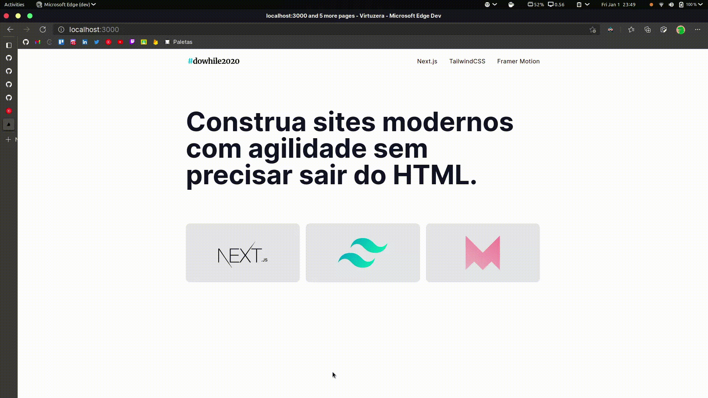

  

  

  

<h3 align="center">
  Next.js + TailwindCSS + Framer Motion
</h3>

<h5 align="center">
  Repositório para aprender a manipular TailwindCSS e animações com Framer Motion.
</h5>

## :bookmark: Sobre

Este repositório é o resultado do workshop "Interfaces futurísticas com Next.js, TailwindCSS e Framer Motion" realizado durante o **#DOWhile2020** criado pela [Rocketseat](https://rocketseat.com.br/) e ministrado pelo [Guilherme Rodz](https://github.com/guilhermerodz).

Durante o workshop a Guilherme explica muito bem como utilizar o TailwindCSS dentro do Next.js para criar interfaces amigáveis e responsivas, também ensina a criar animações simples com o Framer Motion.

## :rocket: Tecnologias utilizadas

- [Next.js](https://nextjs.org/)
- [TailwindCSS](https://tailwindcss.com/)
- [Framer Motion](https://www.framer.com/motion/)
- [Typescript](https://www.typescriptlang.org/)

## ✅ Resultado

  

